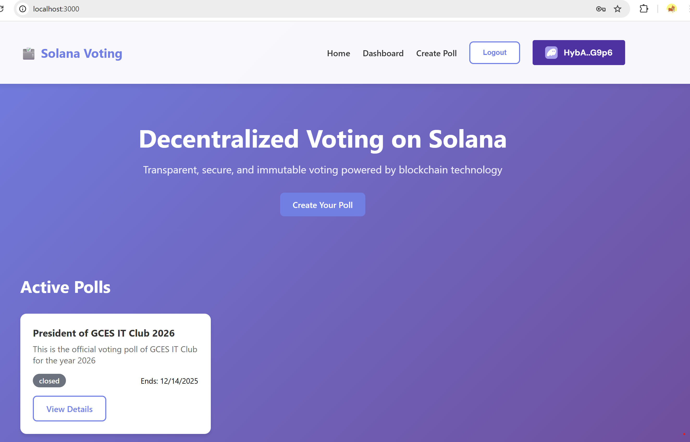
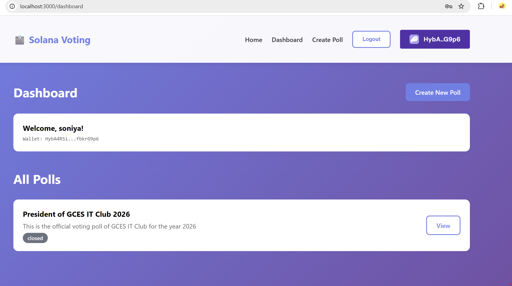
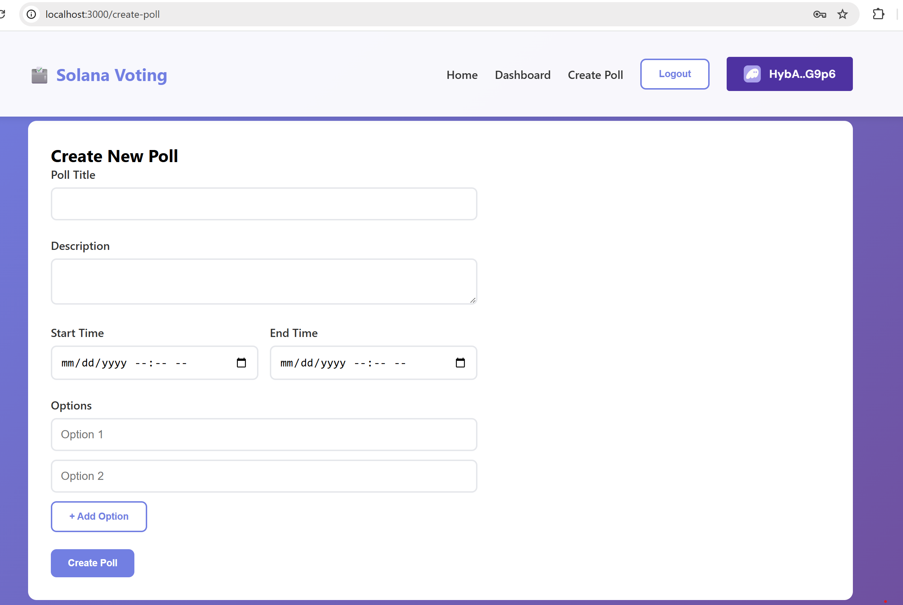
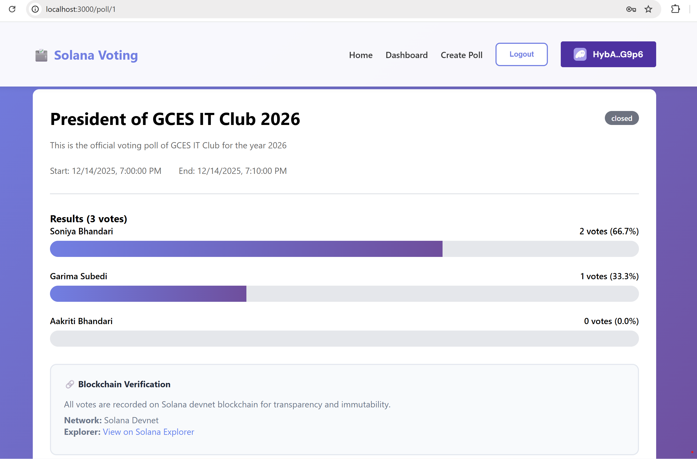
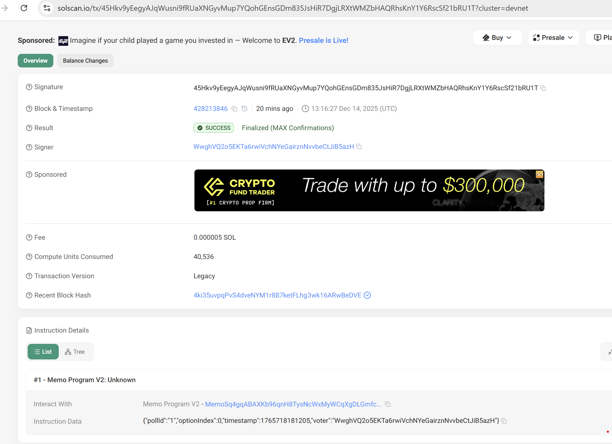
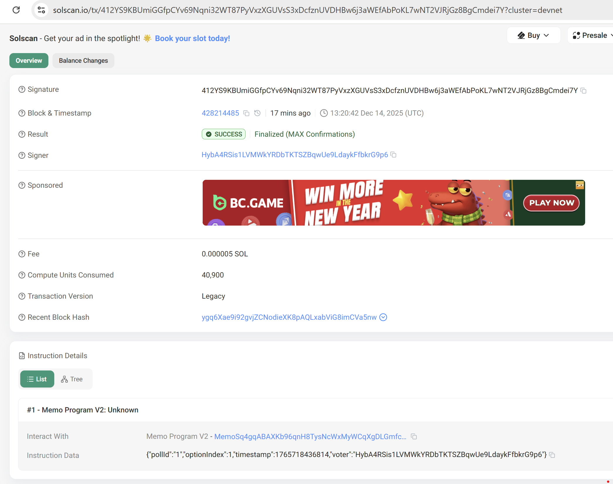

# Decentralized Voting System on Solana

A blockchain-based voting system built on Solana devnet with React frontend, Node.js backend, and MySQL database.

## Project Structure

```
├── smart-contract/     # Solana program (smart contract)
├── backend/           # Node.js + Express + Sequelize
├── frontend/          # React + TypeScript
└── README.md
```

## Prerequisites

- Node.js (v16+)
- Rust and Solana CLI tools
- MySQL database
- Phantom wallet (for testing)

## Setup Instructions

### 1. Smart Contract Setup
```bash
cd smart-contract
cargo build-bpf
solana program deploy target/deploy/voting_system.so
```

### 2. Backend Setup
```bash
cd backend
npm install
# Configure .env file with database credentials
npm run dev
```

### 3. Frontend Setup
```bash
cd frontend
npm install
npm start
```

## Features

- Create voting polls on Solana blockchain
- Cast votes securely using wallet signatures
- View real-time voting results
- Transparent and immutable vote records
- User authentication and authorization
- Poll management dashboard

## Technology Stack

- **Blockchain**: Solana (Devnet)
- **Smart Contract**: Rust + Anchor Framework
- **Frontend**: React + TypeScript + @solana/web3.js
- **Backend**: Node.js + Express
- **Database**: MySQL + Sequelize ORM
- **Wallet**: Phantom/Solflare integration

## License

MIT License - Final Year Project
